# Исследование объявлений о продаже квартир

В вашем распоряжении данные сервиса Яндекс Недвижимость — архив объявлений о продаже квартир в Санкт-Петербурге и соседних населённых пунктах за несколько лет. Вам нужно научиться определять рыночную стоимость объектов недвижимости. Для этого проведите исследовательский анализ данных и установите параметры, влияющие на цену объектов. Это позволит построить автоматизированную систему: она отследит аномалии и мошенническую деятельность.

По каждой квартире на продажу доступны два вида данных. Первые вписаны пользователем, вторые — получены автоматически на основе картографических данных. Например, расстояние до центра, аэропорта и других объектов — эти данные автоматически получены из геосервисов. Количество парков и водоёмов также заполняется без участия пользователя.

### Откройте файл с данными и изучите общую информацию


```python
import pandas as pd
import numpy as np
```


```python
data = pd.read_csv('/datasets/real_estate_data.csv', sep='\t')
data.info()
data.hist(figsize = (15, 20))
data.head()
```

    <class 'pandas.core.frame.DataFrame'>
    RangeIndex: 23699 entries, 0 to 23698
    Data columns (total 22 columns):
     #   Column                Non-Null Count  Dtype  
    ---  ------                --------------  -----  
     0   total_images          23699 non-null  int64  
     1   last_price            23699 non-null  float64
     2   total_area            23699 non-null  float64
     3   first_day_exposition  23699 non-null  object 
     4   rooms                 23699 non-null  int64  
     5   ceiling_height        14504 non-null  float64
     6   floors_total          23613 non-null  float64
     7   living_area           21796 non-null  float64
     8   floor                 23699 non-null  int64  
     9   is_apartment          2775 non-null   object 
     10  studio                23699 non-null  bool   
     11  open_plan             23699 non-null  bool   
     12  kitchen_area          21421 non-null  float64
     13  balcony               12180 non-null  float64
     14  locality_name         23650 non-null  object 
     15  airports_nearest      18157 non-null  float64
     16  cityCenters_nearest   18180 non-null  float64
     17  parks_around3000      18181 non-null  float64
     18  parks_nearest         8079 non-null   float64
     19  ponds_around3000      18181 non-null  float64
     20  ponds_nearest         9110 non-null   float64
     21  days_exposition       20518 non-null  float64
    dtypes: bool(2), float64(14), int64(3), object(3)
    memory usage: 3.7+ MB


<div>
<table border="1" class="dataframe">
  <thead>
    <tr style="text-align: right;">
      <th></th>
      <th>total_images</th>
      <th>last_price</th>
      <th>total_area</th>
      <th>first_day_exposition</th>
      <th>rooms</th>
      <th>ceiling_height</th>
      <th>floors_total</th>
      <th>living_area</th>
      <th>floor</th>
      <th>is_apartment</th>
      <th>...</th>
      <th>kitchen_area</th>
      <th>balcony</th>
      <th>locality_name</th>
      <th>airports_nearest</th>
      <th>cityCenters_nearest</th>
      <th>parks_around3000</th>
      <th>parks_nearest</th>
      <th>ponds_around3000</th>
      <th>ponds_nearest</th>
      <th>days_exposition</th>
    </tr>
  </thead>
  <tbody>
    <tr>
      <th>0</th>
      <td>20</td>
      <td>13000000.0</td>
      <td>108.0</td>
      <td>2019-03-07T00:00:00</td>
      <td>3</td>
      <td>2.70</td>
      <td>16.0</td>
      <td>51.0</td>
      <td>8</td>
      <td>NaN</td>
      <td>...</td>
      <td>25.0</td>
      <td>NaN</td>
      <td>Санкт-Петербург</td>
      <td>18863.0</td>
      <td>16028.0</td>
      <td>1.0</td>
      <td>482.0</td>
      <td>2.0</td>
      <td>755.0</td>
      <td>NaN</td>
    </tr>
    <tr>
      <th>1</th>
      <td>7</td>
      <td>3350000.0</td>
      <td>40.4</td>
      <td>2018-12-04T00:00:00</td>
      <td>1</td>
      <td>NaN</td>
      <td>11.0</td>
      <td>18.6</td>
      <td>1</td>
      <td>NaN</td>
      <td>...</td>
      <td>11.0</td>
      <td>2.0</td>
      <td>посёлок Шушары</td>
      <td>12817.0</td>
      <td>18603.0</td>
      <td>0.0</td>
      <td>NaN</td>
      <td>0.0</td>
      <td>NaN</td>
      <td>81.0</td>
    </tr>
    <tr>
      <th>2</th>
      <td>10</td>
      <td>5196000.0</td>
      <td>56.0</td>
      <td>2015-08-20T00:00:00</td>
      <td>2</td>
      <td>NaN</td>
      <td>5.0</td>
      <td>34.3</td>
      <td>4</td>
      <td>NaN</td>
      <td>...</td>
      <td>8.3</td>
      <td>0.0</td>
      <td>Санкт-Петербург</td>
      <td>21741.0</td>
      <td>13933.0</td>
      <td>1.0</td>
      <td>90.0</td>
      <td>2.0</td>
      <td>574.0</td>
      <td>558.0</td>
    </tr>
    <tr>
      <th>3</th>
      <td>0</td>
      <td>64900000.0</td>
      <td>159.0</td>
      <td>2015-07-24T00:00:00</td>
      <td>3</td>
      <td>NaN</td>
      <td>14.0</td>
      <td>NaN</td>
      <td>9</td>
      <td>NaN</td>
      <td>...</td>
      <td>NaN</td>
      <td>0.0</td>
      <td>Санкт-Петербург</td>
      <td>28098.0</td>
      <td>6800.0</td>
      <td>2.0</td>
      <td>84.0</td>
      <td>3.0</td>
      <td>234.0</td>
      <td>424.0</td>
    </tr>
    <tr>
      <th>4</th>
      <td>2</td>
      <td>10000000.0</td>
      <td>100.0</td>
      <td>2018-06-19T00:00:00</td>
      <td>2</td>
      <td>3.03</td>
      <td>14.0</td>
      <td>32.0</td>
      <td>13</td>
      <td>NaN</td>
      <td>...</td>
      <td>41.0</td>
      <td>NaN</td>
      <td>Санкт-Петербург</td>
      <td>31856.0</td>
      <td>8098.0</td>
      <td>2.0</td>
      <td>112.0</td>
      <td>1.0</td>
      <td>48.0</td>
      <td>121.0</td>
    </tr>
  </tbody>
</table>
<p>5 rows × 22 columns</p>
</div>


    
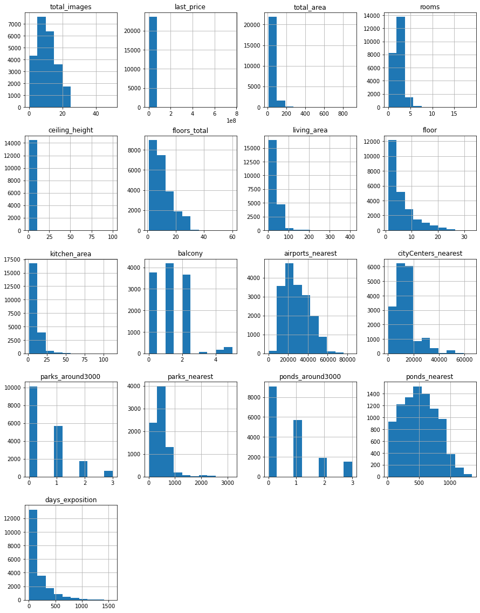
    


По гистограммам можно заметить явные аномалии:

* Абсолютное большинство квартир стоит менее 50 млн. рублей, но при этом есть отдельные квартиры стоимостью до 800 млн.
* Общая площадь большинства квартир до 200 м$^2$, но есть квартиры площадью до 800
* Жилая площадь большинства квартир до 100 м$^2$, но есть квартиры с жилой площадью до 400
* Площадь кухонь большинства квартир до 50 м$^2$, но есть квартиры площадью до 100
* Количество комнат у большинства квартир 5 или меньше, но есть квартиры с 15 комнатами

### Выполните предобработку данных

Пропуски обнаружены в следующих столбцах:
* ceiling height - следует заменить на медианное значение известных высот потолков в этом городе (если информация об этом впринципе есть)
* floors_total - оставить пустым (эту инфомацию нельзя логично заменить)
* living_area - можно посчитать медиану отношения жилой площади к площади квартиры и подставить в пустые ячейки
* is_apartment - в этом столбце почти 90% пользователей ничего не написали. А также далее в исследовании этот столбец использоваться не будет. Так что логичнее всего оставить в нём пустые значения
* kitchen_area - аналогично с living_area
* balcony - заменить пустые значения на 0 (если количество балконов не указано, их скорее всего нет)
* locality_name - можно оставить пустым/поменять на "Неизвестно"
* airports_nearest и cityCenters_nearest - логичной замены для всех пустых значений нет, однако для всех локаций, кроме Санкт-Петербург, можно взять медиану по населённому пункту (населенные пункты достаточно небольшие, а центр города и аэропорт в Петербурге один). А также следует переименовать столбец cinyCenters_nearest в city_centers_nearest
* parks_around3000 и ponds_around3000 - пустые значения заменить на 0 (если парки и пруды рядом не указаны, скорее всего, их нет)
* parks_nearest и ponds_nearest - оставить пустыми, если parks_around3000/ponds_around3000 равны нулю/пустые, или заполнить значением 3000 все остальные
* days_exposition - оставить пустыми (нет логичной замены)


```python
#заполнение пропусков в данных
for locs in data['locality_name'].unique(): #заполнение пропусков в столбце ceiling_height
    if len(data.loc[(data['ceiling_height'].isna()) & (data['locality_name'] == locs)]) == len(data.loc[data['locality_name'] == locs]):
        #проверка на случай, если в данном населённом пункте нет ни одной известной высоты потолка
        continue
    data.loc[(data['ceiling_height'].isna()) & (data['locality_name'] == locs), 'ceiling_height'] = (
         data.loc[data['locality_name'] == locs]['ceiling_height'].median()
     )
data = data.rename(columns = {'cityCenters_nearest':'city_centers_nearest'})

for locs in data['locality_name'].unique(): #заполнение пропусков в столбцах airport_nearest и city_centers_nearest
    if locs == 'Санкт-Петербург':
       #в случае Санкт-Петербурга подобное усреднение использовать не следует 
       continue
    if len(data.loc[(data['airports_nearest'].isna()) & (data['locality_name'] == locs)]) != len(data.loc[data['locality_name'] == locs]):
        #проверка, есть ли в данном населённом пункте хотя бы одно одного известное расстояние до аэропорта
        data.loc[(data['airports_nearest'].isna()) & (data['locality_name'] == locs), 'airports_nearest'] = (
        data.loc[data['locality_name'] == locs]['airports_nearest'].median()
     )
    if len(data.loc[(data['city_centers_nearest'].isna()) & (data['locality_name'] == locs)]) != len(data.loc[data['locality_name'] == locs]):
        #проверка, есть ли в данном населённом пункте хотя бы одно одного известное расстояние до центра города
        data.loc[(data['city_centers_nearest'].isna()) & (data['locality_name'] == locs), 'city_centers_nearest'] = (
        data.loc[data['locality_name'] == locs]['city_centers_nearest'].median()
     )
```


```python
data['balcony'] = data['balcony'].fillna(0)
data['parks_around3000'] = data['parks_around3000'].fillna(0)
data['ponds_around3000'] = data['ponds_around3000'].fillna(0)
data['locality_name'] = data['locality_name'].fillna('Неизвестно')
data.loc[(data['parks_nearest'].isna()) & (data['parks_around3000'] > 0)] = 3000
data.loc[(data['ponds_nearest'].isna()) & (data['ponds_around3000'] > 0)] = 3000
living_perc = data['living_area']/data['total_area']

data.info()
```

    <class 'pandas.core.frame.DataFrame'>
    RangeIndex: 23699 entries, 0 to 23698
    Data columns (total 22 columns):
     #   Column                Non-Null Count  Dtype  
    ---  ------                --------------  -----  
     0   total_images          23699 non-null  int64  
     1   last_price            23699 non-null  float64
     2   total_area            23699 non-null  float64
     3   first_day_exposition  23699 non-null  object 
     4   rooms                 23699 non-null  int64  
     5   ceiling_height        23543 non-null  float64
     6   floors_total          23613 non-null  float64
     7   living_area           21796 non-null  float64
     8   floor                 23699 non-null  int64  
     9   is_apartment          2775 non-null   object 
     10  studio                23699 non-null  object 
     11  open_plan             23699 non-null  object 
     12  kitchen_area          21421 non-null  float64
     13  balcony               23699 non-null  float64
     14  locality_name         23699 non-null  object 
     15  airports_nearest      18220 non-null  float64
     16  city_centers_nearest  18244 non-null  float64
     17  parks_around3000      23699 non-null  float64
     18  parks_nearest         8079 non-null   float64
     19  ponds_around3000      23699 non-null  float64
     20  ponds_nearest         9110 non-null   float64
     21  days_exposition       20518 non-null  float64
    dtypes: float64(14), int64(3), object(5)
    memory usage: 4.0+ MB


В таблице осталось ещё большое количество пустых ячеек, однако метода их заполнения придумано не было
* Большое количество пропусков в столбце *is_apartment* объясняется тем, что из объявления всегда понятно, дом это или квартира, так что люди при создании объявления этого не указывают.
* Пропуски в столбце *balcony* можно объяснить тем, что люди не указывают количество балконов, если их нет
* Пустые значения в столбцах *ceiling_height* и *floors_total* можно объяснить тем, что люди просто решили это не указывать (в случае с *floors_total* для некоторых случаев также вероятен вариант, что человек не указал количество этажей, поскольку эо частный дом) 

*Примечание: вызывает вопросы столь большое количество пропусков в ячейках с расстоянием до объектов, ведь, согласно заданию, эти данные должны получаться автоматически из геосервисов. Так что следовало бы проверить эти алгоритмы поиска расстояния до объектов*


```python
#Замена типов данных
data['last_price'] = data['last_price'].astype('int')
#data['floors_total'] = data['floors_total'].fillna(0)
#data['floors_total'] = data['floors_total'].astype('int')
#data.loc[data['floors_total' == 0]]['floors_total'] = "NaN"
data['balcony'] = data['balcony'].astype('int')
data['parks_around3000'] = data['parks_around3000'].astype('int')
data['ponds_around3000'] = data['ponds_around3000'].astype('int')
#data['airports_nearest'] = data['airports_nearest'].astype('int')
#data['city_centers_nearest'] = data['city_centers_nearest'].astype('int')
data['first_day_exposition'] = pd.to_datetime(data['first_day_exposition'], format='%Y-%m-%dT%H:%M:%S')

data.head()
```


<div>
<table border="1" class="dataframe">
  <thead>
    <tr style="text-align: right;">
      <th></th>
      <th>total_images</th>
      <th>last_price</th>
      <th>total_area</th>
      <th>first_day_exposition</th>
      <th>rooms</th>
      <th>ceiling_height</th>
      <th>floors_total</th>
      <th>living_area</th>
      <th>floor</th>
      <th>is_apartment</th>
      <th>...</th>
      <th>kitchen_area</th>
      <th>balcony</th>
      <th>locality_name</th>
      <th>airports_nearest</th>
      <th>city_centers_nearest</th>
      <th>parks_around3000</th>
      <th>parks_nearest</th>
      <th>ponds_around3000</th>
      <th>ponds_nearest</th>
      <th>days_exposition</th>
    </tr>
  </thead>
  <tbody>
    <tr>
      <th>0</th>
      <td>20</td>
      <td>13000000</td>
      <td>108.0</td>
      <td>2019-03-07</td>
      <td>3</td>
      <td>2.70</td>
      <td>16.0</td>
      <td>51.0</td>
      <td>8</td>
      <td>NaN</td>
      <td>...</td>
      <td>25.0</td>
      <td>0</td>
      <td>Санкт-Петербург</td>
      <td>18863.0</td>
      <td>16028.0</td>
      <td>1</td>
      <td>482.0</td>
      <td>2</td>
      <td>755.0</td>
      <td>NaN</td>
    </tr>
    <tr>
      <th>1</th>
      <td>7</td>
      <td>3350000</td>
      <td>40.4</td>
      <td>2018-12-04</td>
      <td>1</td>
      <td>2.63</td>
      <td>11.0</td>
      <td>18.6</td>
      <td>1</td>
      <td>NaN</td>
      <td>...</td>
      <td>11.0</td>
      <td>2</td>
      <td>посёлок Шушары</td>
      <td>12817.0</td>
      <td>18603.0</td>
      <td>0</td>
      <td>NaN</td>
      <td>0</td>
      <td>NaN</td>
      <td>81.0</td>
    </tr>
    <tr>
      <th>2</th>
      <td>10</td>
      <td>5196000</td>
      <td>56.0</td>
      <td>2015-08-20</td>
      <td>2</td>
      <td>2.70</td>
      <td>5.0</td>
      <td>34.3</td>
      <td>4</td>
      <td>NaN</td>
      <td>...</td>
      <td>8.3</td>
      <td>0</td>
      <td>Санкт-Петербург</td>
      <td>21741.0</td>
      <td>13933.0</td>
      <td>1</td>
      <td>90.0</td>
      <td>2</td>
      <td>574.0</td>
      <td>558.0</td>
    </tr>
    <tr>
      <th>3</th>
      <td>0</td>
      <td>64900000</td>
      <td>159.0</td>
      <td>2015-07-24</td>
      <td>3</td>
      <td>2.70</td>
      <td>14.0</td>
      <td>NaN</td>
      <td>9</td>
      <td>NaN</td>
      <td>...</td>
      <td>NaN</td>
      <td>0</td>
      <td>Санкт-Петербург</td>
      <td>28098.0</td>
      <td>6800.0</td>
      <td>2</td>
      <td>84.0</td>
      <td>3</td>
      <td>234.0</td>
      <td>424.0</td>
    </tr>
    <tr>
      <th>4</th>
      <td>2</td>
      <td>10000000</td>
      <td>100.0</td>
      <td>2018-06-19</td>
      <td>2</td>
      <td>3.03</td>
      <td>14.0</td>
      <td>32.0</td>
      <td>13</td>
      <td>NaN</td>
      <td>...</td>
      <td>41.0</td>
      <td>0</td>
      <td>Санкт-Петербург</td>
      <td>31856.0</td>
      <td>8098.0</td>
      <td>2</td>
      <td>112.0</td>
      <td>1</td>
      <td>48.0</td>
      <td>121.0</td>
    </tr>
  </tbody>
</table>
<p>5 rows × 22 columns</p>
</div>


Типы столбцов *last_price*, *balcony*, *parks_around3000* и *ponds_around3000* были заменены с float64 на int64, т.к. это могут быть только целые значения (возможные копейки в цене в столбце *last_price* никак не повлияли бы на дальнейший анализ). Также была попытка заменить тип данных и в столбцах *floors_total*, *airport_nearest*, *city_centers_nearest*, *parks_nearest* и *ponds_nearest*, однако это не получилось сделать из-за наличия в этих столбцах пустых ячеек. Тип столбца *first_day_exposition* был заменен на datetime64, т.к. это дата


```python
#Поиск неявных дубликатов
print(sorted(data['locality_name'].unique(), key=lambda item:item[::-1]))
#print('Количество посёлков до удаления дубликатов:', len(data['locality_name'].unique()))
dubls = {'городской поселок Янино-1':'городской посёлок Янино-1', 'поселок городского типа имени Свердлова':'посёлок городского типа имени Свердлова',\
        'городской посёлок Мга':'посёлок городского типа Мга', 'поселок Усть-Луга': 'посёлок Усть-Луга', 'поселок Победа': 'посёлок Победа',\
        'поселок Тельмана': 'посёлок Тельмана','поселок городского типа Большая Ижора': 'городской поселок Большая Ижора', 'поселок Старая Малукса': 'посёлок Старая Малукса',\
        'поселок городского типа Вырица': 'посёлок городского типа Вырица', 'поселок Возрождение': 'посёлок Возрождение', 'городской посёлок Фёдоровское': 'деревня Фёдоровское',\
        'поселок Петровское': 'посёлок Петровское', 'посёлок при железнодорожной станции Приветнинское': 'поселок станции Приветнинское', 'поселок Мичуринское': 'посёлок Мичуринское',\
        'Никольское': 'село Никольское','поселок Лесное': 'коттеджный посёлок Лесное','поселок городского типа Лебяжье': 'посёлок городского типа Лебяжье',\
       'поселок городского типа Приладожский': 'садовое товарищество Приладожский', 'поселок городского типа Лесогорский': 'городской посёлок Лесогорский', 'поселок городского типа Советский': 'городской посёлок Советский',\
        'поселок Стеклянный': 'посёлок Стеклянный','посёлок при железнодорожной станции Вещево': 'поселок станции Вещево', 'поселок Рябово':'посёлок городского типа Рябово', 'поселок городского типа Рябово' : 'посёлок городского типа Рябово',\
         'поселок Мельниково': 'посёлок Мельниково', 'поселок Кобралово': 'посёлок Кобралово', 'посёлок городского типа Павлово': 'городской посёлок Павлово', 'село Павлово': 'городской посёлок Павлово',\
        'посёлок Щеглово': 'деревня Щеглово', 'поселок Гаврилово': 'посёлок Гаврилово','поселок Гарболово': 'деревня Гарболово', 'поселок Терволово': 'посёлок Терволово',\
        'посёлок станции Громово': 'поселок Громово', 'Кудрово': 'деревня Кудрово', 'поселок Перово': 'посёлок Перово', 'поселок городского типа Токсово': 'посёлок городского типа Токсово', 'поселок городского типа Форносово': 'посёлок городского типа Форносово',\
        'поселок Ильичёво': 'посёлок Ильичёво', 'поселок Сумино': 'посёлок Сумино', 'поселок Аннино': 'посёлок Аннино', 'Мурино': 'посёлок Мурино','поселок Мурино': 'посёлок Мурино',\
        'поселок Калитино': 'деревня Калитино', 'поселок городского типа Рощино': 'посёлок городского типа Рощино', 'городской посёлок Рощино': 'посёлок городского типа Рощино',\
        'поселок Коробицыно': 'посёлок Коробицыно', 'поселок городского типа Красный Бор': 'посёлок городского типа Красный Бор', 'поселок Пансионат Зелёный Бор': 'посёлок Пансионат Зелёный Бор',\
        'поселок Лисий Нос': 'посёлок Лисий Нос', 'поселок Новый Свет': 'посёлок Новый Свет','поселок Поляны': 'посёлок Поляны', 'поселок Бугры': 'посёлок Бугры',\
        'поселок Рабитицы': 'деревня Рабитицы', 'поселок Зимитицы': 'деревня Зимитицы', 'Любань': 'поселок Любань','поселок городского типа Назия': 'городской посёлок Назия', 'поселок городского типа Рахья': 'садовое товарищество Рахья'}

for dub in dubls.keys():
    data.loc[data['locality_name'] == dub, 'locality_name'] = dubls[dub]

#print('Количество посёлков после удаления дубликатов:', len(data['locality_name'].unique()))

```

    ['городской поселок Янино-1', 'городской посёлок Янино-1', 'поселок Тёсово-4', 'деревня Пчева', 'деревня Борисова Грива', 'посёлок городского типа имени Морозова', 'поселок городского типа имени Свердлова', 'посёлок городского типа имени Свердлова', 'посёлок городского типа Мга', 'городской посёлок Мга', 'Новая Ладога', 'село Старая Ладога', 'Луга', 'поселок Усть-Луга', 'посёлок Усть-Луга', 'поселок Победа', 'посёлок Победа', 'посёлок Суйда', 'деревня Суоранда', 'деревня Большая Вруда', 'поселок Пчевжа', 'деревня Большая Пустомержа', 'посёлок Алексеевка', 'деревня Заневка', 'посёлок Мыза-Ивановка', 'поселок Романовка', 'деревня Малая Романовка', 'посёлок городского типа Ульяновка', 'поселок городского типа Дубровка', 'деревня Камышовка', 'деревня Снегирёвка', 'поселок станции Лужайка', 'деревня Глинка', 'деревня Лопухинка', 'деревня Пустынка', 'посёлок Петро-Славянка', 'поселок городского типа Дружная Горка', 'посёлок Форт Красная Горка', 'деревня Белогорка', 'деревня Выскатка', 'деревня Пижма', 'деревня Нурма', 'поселок Тельмана', 'посёлок Тельмана', 'поселок Красная Долина', 'Гатчина', 'посёлок Стрельна', 'садоводческое некоммерческое товарищество Лесная Поляна', 'деревня Вахнова Кара', 'деревня Извара', 'деревня Пельгора', 'поселок городского типа Большая Ижора', 'городской поселок Большая Ижора', 'посёлок Усть-Ижора', 'поселок Старая Малукса', 'посёлок Старая Малукса', 'поселок городского типа Вырица', 'посёлок городского типа Вырица', 'село Паша', 'посёлок Ропша', 'садовое товарищество Новая Ропша', 'посёлок Белоостров', 'Ломоносов', 'Волхов', 'Выборг', 'Санкт-Петербург', 'Шлиссельбург', 'деревня Иссад', 'Ивангород', 'деревня Хапо-Ое', 'поселок Возрождение', 'посёлок Возрождение', 'Лодейное Поле', 'посёлок Плодовое', 'поселок Гладкое', 'городской посёлок Фёдоровское', 'деревня Фёдоровское', 'поселок Петровское', 'посёлок Петровское', 'поселок Запорожское', 'поселок Первомайское', 'посёлок Ленинское', 'посёлок при железнодорожной станции Приветнинское', 'поселок станции Приветнинское', 'поселок Кобринское', 'поселок Мичуринское', 'посёлок Мичуринское', 'посёлок Плоское', 'поселок Володарское', 'поселок Красносельское', 'Никольское', 'село Никольское', 'село Русско-Высоцкое', 'Отрадное', 'посёлок Молодёжное', 'посёлок Сапёрное', 'поселок Лесное', 'коттеджный посёлок Лесное', 'посёлок городского типа Кузнечное', 'поселок Кирпичное', 'поселок Пушное', 'посёлок Торфяное', 'Подпорожье', 'поселок городского типа Лебяжье', 'посёлок городского типа Лебяжье', 'городской посёлок Новоселье', 'поселок Дружноселье', 'деревня Раздолье', 'поселок Суходолье', 'деревня Старополье', 'посёлок городского типа Вознесенье', 'деревня Заклинье', 'поселок Семиозерье', 'село Копорье', 'коттеджный поселок Счастье', 'поселок Оредеж', 'поселок Новый Учхоз', 'деревня Вартемяги', 'деревня Пудомяги', 'деревня Келози', 'городской посёлок Виллози', 'деревня Куттузи', 'поселок Ушаки', 'деревня Пеники', 'деревня Лаврики', 'деревня Юкки', 'деревня Горбунки', 'поселок Ромашки', 'деревня Хязельки', 'деревня Нижние Осельки', 'деревня Ненимяки', 'поселок Торковичи', 'деревня Торошковичи', 'поселок Лукаши', 'Кириши', 'деревня Колтуши', 'поселок городского типа Кузьмоловский', 'посёлок городского типа Кузьмоловский', 'поселок городского типа Ефимовский', 'поселок городского типа Приладожский', 'садовое товарищество Приладожский', 'поселок Серебрянский', 'поселок Кингисеппский', 'посёлок городского типа Сиверский', 'поселок городского типа Лесогорский', 'городской посёлок Лесогорский', 'поселок городского типа Советский', 'городской посёлок Советский', 'поселок Котельский', 'поселок городского типа Никольский', 'посёлок Высокоключевой', 'поселок Заводской', 'посёлок Металлострой', 'городской посёлок Свирьстрой', 'Сясьстрой', 'посёлок Пригородный', 'поселок Совхозный', 'посёлок Понтонный', 'поселок Стеклянный', 'посёлок Стеклянный', 'посёлок Сапёрный', 'посёлок Песочный', 'поселок Жилгородок', 'посёлок Жилгородок', 'поселок Жилпосёлок', 'поселок Починок', 'деревня Большой Сабск', 'Павловск', 'Кировск', 'Всеволожск', 'Приозерск', 'Зеленогорск', 'Каменногорск', 'Светогорск', 'Бокситогорск', 'Приморск', 'Сестрорецк', 'Высоцк', 'село Шум', 'Тихвин', 'Пушкин', 'деревня Разбегаево', 'деревня Фалилеево', 'поселок Глажево', 'деревня Яльгелево', 'деревня Сяськелево', 'деревня Разметелево', 'поселок станции Корнево', 'деревня Малое Верево', 'поселок Глебычево', 'поселок Барышево', 'посёлок при железнодорожной станции Вещево', 'поселок станции Вещево', 'поселок городского типа Кондратьево', 'поселок Цвелодубово', 'поселок городского типа Рябово', 'посёлок городского типа Рябово', 'поселок Рябово', 'поселок Мельниково', 'посёлок Мельниково', 'поселок Житково', 'деревня Шпаньково', 'деревня Меньково', 'деревня Каськово', 'поселок Кобралово', 'посёлок Кобралово', 'посёлок городского типа Павлово', 'городской посёлок Павлово', 'село Павлово', 'поселок Углово', 'посёлок Щеглово', 'деревня Щеглово', 'посёлок Новогорелово', 'поселок Гаврилово', 'посёлок Гаврилово', 'село Путилово', 'деревня Мануйлово', 'поселок Гарболово', 'деревня Гарболово', 'поселок Терволово', 'посёлок Терволово', 'деревня Лаголово', 'посёлок Парголово', 'деревня Пикколово', 'деревня Старое Хинколово', 'деревня Лесколово', 'деревня Кузьмолово', 'деревня Рапполово', 'деревня Лупполово', 'Сертолово', 'деревня Мистолово', 'посёлок станции Громово', 'поселок Громово', 'деревня Ваганово', 'посёлок Сосново', 'поселок Севастьяново', 'деревня Лампово', 'поселок Гончарово', 'деревня Реброво', 'Кудрово', 'деревня Кудрово', 'поселок Перово', 'посёлок Перово', 'деревня Тойворово', 'посёлок Войскорово', 'деревня Тарасово', 'деревня Ям-Тесово', 'поселок городского типа Токсово', 'посёлок городского типа Токсово', 'Волосово', 'поселок городского типа Форносово', 'посёлок городского типа Форносово', 'деревня Торосово', 'деревня Батово', 'деревня Агалатово', 'поселок Молодцово', 'посёлок Левашово', 'Пикалёво', 'поселок Цвылёво', 'поселок Селезнёво', 'поселок Ильичёво', 'посёлок Ильичёво', 'посёлок Дзержинского', 'деревня Кривко', 'садовое товарищество Садко', 'деревня Русско', 'Красное Село', 'село Рождествено', 'деревня Сижно', 'поселок городского типа Синявино', 'деревня Ялгино', 'деревня Низино', 'деревня Большое Рейзино', 'деревня Коркино', 'деревня Новое Девяткино', 'деревня Малое Карлино', 'поселок Сумино', 'посёлок Сумино', 'поселок Аннино', 'посёлок Аннино', 'посёлок Репино', 'Колпино', 'посёлок Кикерино', 'поселок Семрино', 'Мурино', 'поселок Мурино', 'посёлок Мурино', 'деревня Новолисино', 'поселок Елизаветино', 'поселок Калитино', 'деревня Калитино', 'деревня Кальтино', 'поселок городского типа Рощино', 'посёлок городского типа Рощино', 'городской посёлок Рощино', 'Тосно', 'Неизвестно', 'поселок Коробицыно', 'посёлок Коробицыно', 'деревня Аро', 'посёлок Шугозеро', 'поселок Сельцо', 'поселок Почап', 'Кингисепп', 'Коммунар', 'коттеджный поселок Кивеннапа Север', 'деревня Трубников Бор', 'деревня Чудской Бор', 'Сосновый Бор', 'поселок городского типа Красный Бор', 'посёлок городского типа Красный Бор', 'поселок Пансионат Зелёный Бор', 'посёлок Пансионат Зелёный Бор', 'деревня Бор', 'посёлок Платформа 69-й километр', 'поселок Лисий Нос', 'посёлок Лисий Нос', 'Кронштадт', 'поселок Новый Свет', 'посёлок Новый Свет', 'Петергоф', 'деревня Котлы', 'деревня Большие Колпаны', 'деревня Малые Колпаны', 'деревня Мины', 'посёлок городского типа Важины', 'поселок Поляны', 'посёлок Поляны', 'поселок Коммунары', 'посёлок Шушары', 'поселок Бугры', 'посёлок Бугры', 'деревня Курковицы', 'поселок Войсковицы', 'деревня Тихковицы', 'деревня Куровицы', 'поселок Каложицы', 'деревня Оржицы', 'деревня Терпилицы', 'деревня Гостилицы', 'деревня Старые Бегуницы', 'деревня Бегуницы', 'деревня Парицы', 'поселок Рабитицы', 'деревня Рабитицы', 'поселок Зимитицы', 'деревня Зимитицы', 'посёлок городского типа Тайцы', 'Сланцы', 'Любань', 'поселок Любань', 'деревня Кипень', 'посёлок станции Свирь', 'посёлок Пудость', 'деревня Старая Пустошь', 'городской посёлок Будогощь', 'посёлок Александровская', 'деревня Старосиверская', 'деревня Старая', 'поселок городского типа Назия', 'городской посёлок Назия', 'деревня Кисельня', 'поселок городского типа Рахья', 'садовое товарищество Рахья', 'деревня Нижняя']


### Добавьте в таблицу новые столбцы


```python
def floor_type(row):
    if row['floor'] == 1:
        return 'первый'
    if row['floor'] == row['floors_total']:
        return 'последний'
    return 'другой'

data['price_per_square'] = round(data['last_price']/data['total_area'], 2)
data['exposition_day_of_week'] = data['first_day_exposition'].dt.weekday
data['exposition_month'] = data['first_day_exposition'].dt.month
data['exposition_year'] = data['first_day_exposition'].dt.year
data['floor_type'] = data.apply(floor_type, axis = 1)
data['city_center_km'] = round(data['city_centers_nearest']/1000)
data
```


<div>
<table border="1" class="dataframe">
  <thead>
    <tr style="text-align: right;">
      <th></th>
      <th>total_images</th>
      <th>last_price</th>
      <th>total_area</th>
      <th>first_day_exposition</th>
      <th>rooms</th>
      <th>ceiling_height</th>
      <th>floors_total</th>
      <th>living_area</th>
      <th>floor</th>
      <th>is_apartment</th>
      <th>...</th>
      <th>parks_nearest</th>
      <th>ponds_around3000</th>
      <th>ponds_nearest</th>
      <th>days_exposition</th>
      <th>price_per_square</th>
      <th>exposition_day_of_week</th>
      <th>exposition_month</th>
      <th>exposition_year</th>
      <th>floor_type</th>
      <th>city_center_km</th>
    </tr>
  </thead>
  <tbody>
    <tr>
      <th>0</th>
      <td>20</td>
      <td>13000000</td>
      <td>108.00</td>
      <td>2019-03-07</td>
      <td>3</td>
      <td>2.70</td>
      <td>16.0</td>
      <td>51.0</td>
      <td>8</td>
      <td>NaN</td>
      <td>...</td>
      <td>482.0</td>
      <td>2</td>
      <td>755.0</td>
      <td>NaN</td>
      <td>120370.37</td>
      <td>3</td>
      <td>3</td>
      <td>2019</td>
      <td>другой</td>
      <td>16.0</td>
    </tr>
    <tr>
      <th>1</th>
      <td>7</td>
      <td>3350000</td>
      <td>40.40</td>
      <td>2018-12-04</td>
      <td>1</td>
      <td>2.63</td>
      <td>11.0</td>
      <td>18.6</td>
      <td>1</td>
      <td>NaN</td>
      <td>...</td>
      <td>NaN</td>
      <td>0</td>
      <td>NaN</td>
      <td>81.0</td>
      <td>82920.79</td>
      <td>1</td>
      <td>12</td>
      <td>2018</td>
      <td>первый</td>
      <td>19.0</td>
    </tr>
    <tr>
      <th>2</th>
      <td>10</td>
      <td>5196000</td>
      <td>56.00</td>
      <td>2015-08-20</td>
      <td>2</td>
      <td>2.70</td>
      <td>5.0</td>
      <td>34.3</td>
      <td>4</td>
      <td>NaN</td>
      <td>...</td>
      <td>90.0</td>
      <td>2</td>
      <td>574.0</td>
      <td>558.0</td>
      <td>92785.71</td>
      <td>3</td>
      <td>8</td>
      <td>2015</td>
      <td>другой</td>
      <td>14.0</td>
    </tr>
    <tr>
      <th>3</th>
      <td>0</td>
      <td>64900000</td>
      <td>159.00</td>
      <td>2015-07-24</td>
      <td>3</td>
      <td>2.70</td>
      <td>14.0</td>
      <td>NaN</td>
      <td>9</td>
      <td>NaN</td>
      <td>...</td>
      <td>84.0</td>
      <td>3</td>
      <td>234.0</td>
      <td>424.0</td>
      <td>408176.10</td>
      <td>4</td>
      <td>7</td>
      <td>2015</td>
      <td>другой</td>
      <td>7.0</td>
    </tr>
    <tr>
      <th>4</th>
      <td>2</td>
      <td>10000000</td>
      <td>100.00</td>
      <td>2018-06-19</td>
      <td>2</td>
      <td>3.03</td>
      <td>14.0</td>
      <td>32.0</td>
      <td>13</td>
      <td>NaN</td>
      <td>...</td>
      <td>112.0</td>
      <td>1</td>
      <td>48.0</td>
      <td>121.0</td>
      <td>100000.00</td>
      <td>1</td>
      <td>6</td>
      <td>2018</td>
      <td>другой</td>
      <td>8.0</td>
    </tr>
    <tr>
      <th>...</th>
      <td>...</td>
      <td>...</td>
      <td>...</td>
      <td>...</td>
      <td>...</td>
      <td>...</td>
      <td>...</td>
      <td>...</td>
      <td>...</td>
      <td>...</td>
      <td>...</td>
      <td>...</td>
      <td>...</td>
      <td>...</td>
      <td>...</td>
      <td>...</td>
      <td>...</td>
      <td>...</td>
      <td>...</td>
      <td>...</td>
      <td>...</td>
    </tr>
    <tr>
      <th>23694</th>
      <td>9</td>
      <td>9700000</td>
      <td>133.81</td>
      <td>2017-03-21</td>
      <td>3</td>
      <td>3.70</td>
      <td>5.0</td>
      <td>73.3</td>
      <td>3</td>
      <td>NaN</td>
      <td>...</td>
      <td>796.0</td>
      <td>3</td>
      <td>381.0</td>
      <td>NaN</td>
      <td>72490.85</td>
      <td>1</td>
      <td>3</td>
      <td>2017</td>
      <td>другой</td>
      <td>4.0</td>
    </tr>
    <tr>
      <th>23695</th>
      <td>14</td>
      <td>3100000</td>
      <td>59.00</td>
      <td>2018-01-15</td>
      <td>3</td>
      <td>2.50</td>
      <td>5.0</td>
      <td>38.0</td>
      <td>4</td>
      <td>NaN</td>
      <td>...</td>
      <td>NaN</td>
      <td>0</td>
      <td>NaN</td>
      <td>45.0</td>
      <td>52542.37</td>
      <td>0</td>
      <td>1</td>
      <td>2018</td>
      <td>другой</td>
      <td>NaN</td>
    </tr>
    <tr>
      <th>23696</th>
      <td>18</td>
      <td>2500000</td>
      <td>56.70</td>
      <td>2018-02-11</td>
      <td>2</td>
      <td>NaN</td>
      <td>3.0</td>
      <td>29.7</td>
      <td>1</td>
      <td>NaN</td>
      <td>...</td>
      <td>NaN</td>
      <td>0</td>
      <td>NaN</td>
      <td>NaN</td>
      <td>44091.71</td>
      <td>6</td>
      <td>2</td>
      <td>2018</td>
      <td>первый</td>
      <td>NaN</td>
    </tr>
    <tr>
      <th>23697</th>
      <td>13</td>
      <td>11475000</td>
      <td>76.75</td>
      <td>2017-03-28</td>
      <td>2</td>
      <td>3.00</td>
      <td>17.0</td>
      <td>NaN</td>
      <td>12</td>
      <td>NaN</td>
      <td>...</td>
      <td>173.0</td>
      <td>3</td>
      <td>196.0</td>
      <td>602.0</td>
      <td>149511.40</td>
      <td>1</td>
      <td>3</td>
      <td>2017</td>
      <td>другой</td>
      <td>10.0</td>
    </tr>
    <tr>
      <th>23698</th>
      <td>4</td>
      <td>1350000</td>
      <td>32.30</td>
      <td>2017-07-21</td>
      <td>1</td>
      <td>2.50</td>
      <td>5.0</td>
      <td>12.3</td>
      <td>1</td>
      <td>NaN</td>
      <td>...</td>
      <td>NaN</td>
      <td>0</td>
      <td>NaN</td>
      <td>NaN</td>
      <td>41795.67</td>
      <td>4</td>
      <td>7</td>
      <td>2017</td>
      <td>первый</td>
      <td>NaN</td>
    </tr>
  </tbody>
</table>
<p>23699 rows × 28 columns</p>
</div>


### Проведите исследовательский анализ данных

#### Изучение параметров


```python
old_data_size = len(data) #запомним этот параметр, чтобы сравнить, сколько примеров мы отсечём
data['total_area'].plot(kind = 'hist', bins = 10, title = 'Гистограмма распределения площади квартир')
print('Максимальная площадь квартиры:',data['total_area'].max())
print('Медианная площадь квартиры:', data['total_area'].median())
print('Доля квартир площадью больше 200 кв.метров:',\
      len(data.query('total_area > 200'))/len(data))
```

    Максимальная площадь квартиры: 900.0
    Медианная площадь квартиры: 52.0
    Доля квартир площадью больше 200 кв.метров: 0.009578463226296468


    
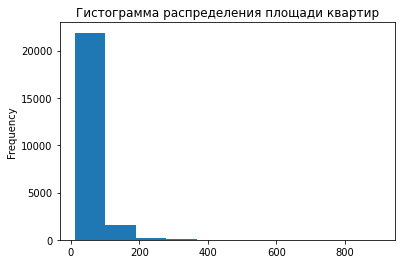
    


Можно увидеть, что гистограмма получается очень сжатая: это связано с тем, что большая часть значений лежит до 200 м$^2$ (больше 99%), но есть и отдельные квартиры площадью до 900 м$^2$. Вероятно, это не ошибка в данных: такие большие квартиры действительно могли попасться в выборке, но всё же в рамках исследования их лучше не учитывать


```python
data = data.loc[(data['total_area'] <= 200) | (data['total_area'].isna())]
data['total_area'].plot(kind = 'hist', bins = 20, title = 'Гистограмма распределения площади квартир')
```


    <AxesSubplot:title={'center':'Гистограмма распределения площади квартир'}, ylabel='Frequency'>


    
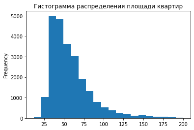
    


```python
data['living_area'].plot(kind = 'hist', bins = 100, title = 'Гистограмма распределения жилой площади квартир')
print('Максимальная жилая площадь квартиры:',data['living_area'].max())
print('Медианная жилая площадь квартиры:', data['living_area'].median())
print('Доля квартир с жилой площадью больше 100 кв.метров:',\
      len(data.query('living_area > 100'))/len(data))

```

    Максимальная жилая площадь квартиры: 164.7
    Медианная жилая площадь квартиры: 30.0
    Доля квартир с жилой площадью больше 100 кв.метров: 0.007370483980913429


    
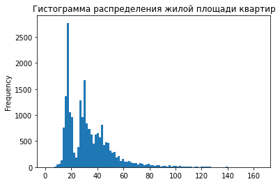
    


Аналогично с предыдущим пунктом, удалим редкие значения


```python
data = data.loc[(data['living_area'] <= 100) | (data['living_area'].isna())]
data['living_area'].plot(kind = 'hist', bins = 20, title = 'Гистограмма распределения жилой площади квартир')
```


    <AxesSubplot:title={'center':'Гистограмма распределения жилой площади квартир'}, ylabel='Frequency'>


    
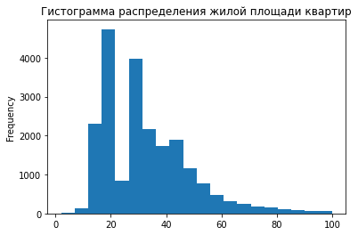
    


Гистограма имеет вид, приближённый к распределению Пуассона, за исключением резкого пробела в выборке кухонь площадью около 25 м$^2$. Однако это скорее всего просто недостаток выборки


```python
data['kitchen_area'].plot(kind = 'hist', bins = 100, title = 'Гистограмма распределения площади кухонь')
print('Максимальная площадь кухни:',data['kitchen_area'].max())
print('Медианная площадь кухни:', data['kitchen_area'].median())
print('Доля квартир с площадью кухни больше 30 кв.метров:',\
      len(data.query('kitchen_area > 30'))/len(data))
```

    Максимальная площадь кухни: 93.2
    Медианная площадь кухни: 9.0
    Доля квартир с площадью кухни больше 30 кв.метров: 0.010644233658096913


    
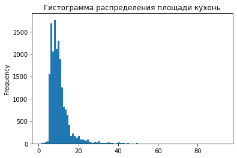
    


```python
#Аналогично удаляем редкие данные
data = data.loc[(data['kitchen_area'] <= 30) | (data['kitchen_area'].isna())]
data['kitchen_area'].plot(kind = 'hist', bins = 20, title = 'Гистограмма распределения площади кухонь')
```


    <AxesSubplot:title={'center':'Гистограмма распределения площади кухонь'}, ylabel='Frequency'>


    
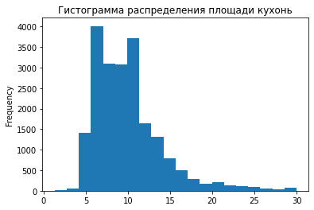
    


```python
data['last_price'].plot(kind = 'hist', bins = 100, title = 'Гистограмма распределения стоимости квартир')
print('Максимальная стоимость квартиры:',data['last_price'].max())
print('Медианная стоимость квартиры:', data['last_price'].median())
print('Доля квартир стоимостью более 25 млн. рублей:',\
      len(data.query('last_price > 2.5 * 10**7'))/len(data))
```

    Максимальная стоимость квартиры: 124000000
    Медианная стоимость квартиры: 4550000.0
    Доля квартир стоимостью более 25 млн. рублей: 0.008806559368357121


    
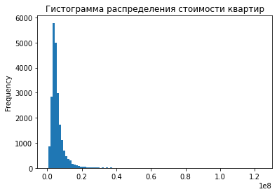
    


Стоимость квартир доходит до 125 миллионов рублей (даже с учётом того, что из таблицы уже убраны квартиры площадью более 200 метров). Но доля квартир стоимостью более 25 миллионов - меньше процента, так что исключим эти квартиры из выборки


```python
data = data.loc[(data['last_price'] <= 25*10**6) | (data['last_price'].isna())]
data['last_price'].plot(kind = 'hist', bins = 20, title = 'Гистограмма распределения стоимости квартир')
```


    <AxesSubplot:title={'center':'Гистограмма распределения стоимости квартир'}, ylabel='Frequency'>


    
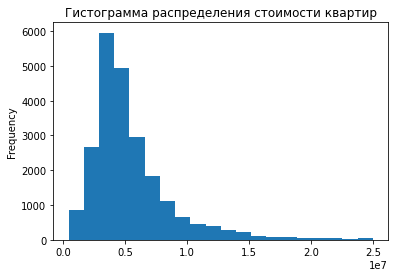
    


```python
data['rooms'].plot(kind = 'hist', bins = 7, title = 'Гистограмма распределения количества комнат')
print('Максимальная стоимость квартиры:',data['rooms'].max())
print('Медианная стоимость квартиры:', data['rooms'].median())
print('Доля квартир с более чем 5 комнатами:',\
      len(data.query('rooms > 5'))/len(data))
```

    Максимальная стоимость квартиры: 7
    Медианная стоимость квартиры: 2.0
    Доля квартир с более чем 5 комнатами: 0.0013130252100840337


    
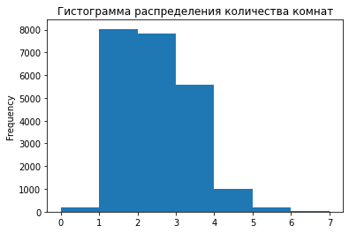
    


```python
#Аналогично удаляем редкие данные
data = data.loc[(data['rooms'] <= 5) | (data['rooms'].isna())]
data['rooms'].plot(kind = 'hist', bins = 5, title = 'Гистограмма распределения количества комнат')
```


    <AxesSubplot:title={'center':'Гистограмма распределения количества комнат'}, ylabel='Frequency'>


    
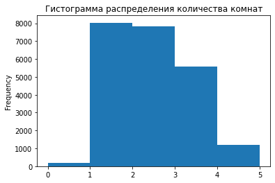
    


```python
data['ceiling_height'].plot(kind = 'hist', bins = 100, title = 'Гистограмма распределения высоты потолков в квартирах')
print('Максимальная высота потолка:',data['ceiling_height'].max())
print('Минимальная высота потолка:',data['ceiling_height'].min())
print('Медианная высота потолка:', data['ceiling_height'].median())
print('Доля квартир с потолком более 4 метров:',\
      len(data.query('ceiling_height > 4'))/len(data))
print('Количество квартир с потолком 20 метров и выше:',\
      len(data.query('ceiling_height >= 20')))
```

    Максимальная высота потолка: 100.0
    Минимальная высота потолка: 1.0
    Медианная высота потолка: 2.7
    Доля квартир с потолком более 4 метров: 0.0027171531247260935
    Количество квартир с потолком 20 метров и выше: 24


    
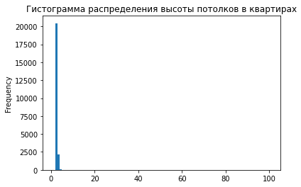
    


В выборке было обнаружено 18 квартир с высотой потолков более 20 метров. Скорее всего, это опечатки при вводе данных, и подразумевалось значение в 10 раз меньше (что не очень объясняет наличие квартиры с высотой потолков 100 метров. В этом случае, возможно человек таким образом "пошутил при составлении объявления"). Так что уменьшим эти значения в 10 раз, а после этого уберём из выборки квартиры с высотой потолков более 4 метров (такие в целом могут существовать, но их доля в выборке менее 0.2%). Также из выборки следует убрать квартиры с высотой потолков менее 2 метров (нереалистичные значения)


```python
data.loc[data['ceiling_height'] >= 20, 'ceiling_height'] =\
data.loc[data['ceiling_height'] >= 20, 'ceiling_height']/10
data = data[data['ceiling_height'] <= 4] = data.loc[((data['ceiling_height'] <= 4) & (data['ceiling_height'] > 2)) | (data['ceiling_height'].isna())]
data['ceiling_height'].plot(kind = 'hist', bins = 20, title = 'Гистограмма распределения высоты потолков в квартирах')
```


    <AxesSubplot:title={'center':'Гистограмма распределения высоты потолков в квартирах'}, ylabel='Frequency'>


    
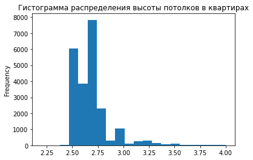
    


```python
'''
Для параметра Тип этажа квартиры (floor_type) гистограмма будет не очень полезная, 
т.к. это не количественная величина. Так что было решено построить круговую
диаграмму для этого параметра
'''
floor_pie = pd.DataFrame({'count': [len(data[data['floor_type'] == 'первый']),\
                                    len(data[data['floor_type'] == 'последний']),\
                                   len(data[data['floor_type'] == 'другой'])]},\
                        index = ['первый', 'последний', ' другой'])
floor_pie.plot(kind = 'pie', y = 'count')
print('Доля квартир на первом этаже:', len(data[data['floor_type'] == 'первый'])/len(data))
print('Доля квартир на последнем этаже:', len(data[data['floor_type'] == 'последний'])/len(data))
print('Доля квартир на прочих этажах:', len(data[data['floor_type'] == 'другой'])/len(data))
```

    Доля квартир на первом этаже: 0.1255491126339835
    Доля квартир на последнем этаже: 0.13793709365665086
    Доля квартир на прочих этажах: 0.7365137937093656


    
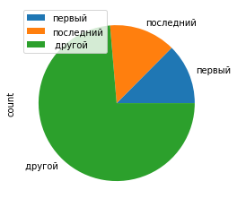
    


```python
data['floors_total'].plot(kind = 'hist', bins = 30, title = 'Гистограмма распределения количества этажей в домах')
print('Максимальное количество этажей:',data['floors_total'].max())
print('Медианное количество этажей:', data['floors_total'].median())
print('Доля домов, в которых более 30 этажей:',\
      len(data.query('floors_total > 30'))/len(data))
```

    Максимальное количество этажей: 60.0
    Медианное количество этажей: 9.0
    Доля домов, в которых более 30 этажей: 0.001361799332279037


    
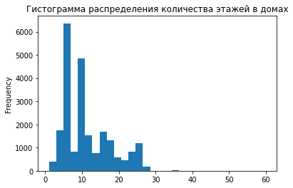
    


В данных оказались дома с количеством этажей до 60 *(хотя самый высокий жилой дом в СПб имеет всего 35 этажей)*. В любом случае, доля домов с количеством этажей более 30 чуть больше 0.1%, так что эти дома можно убрать из выборки


```python
data = data.loc[(data['floors_total'] <= 30) | (data['floors_total'].isna())]
data['floors_total'].plot(kind = 'hist', bins = 30, title = 'Гистограмма распределения количества этажей в домах')
```


    <AxesSubplot:title={'center':'Гистограмма распределения количества этажей в домах'}, ylabel='Frequency'>


    
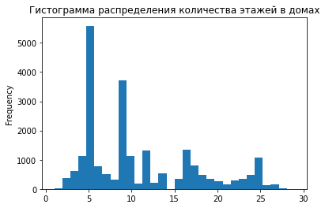
    


Гистограмма не напоминает распределение Пуассона. У гистограммы несколько явных пиков, которые соответствуют высотам домов типовой застройки - 5, 9 и 12


```python
data['city_centers_nearest'].plot(kind = 'hist', bins = 30, title = 'Гистограмма распределения расстояния до центра города')
print('Максимальное расстояние до центра:',data['city_centers_nearest'].max())
print('Медианное расстояние до центра:', data['city_centers_nearest'].median())
print('Доля квартир, удалённых от центра более чем на 40 км:',\
      len(data.query('city_centers_nearest > 40000'))/len(data))
```

    Максимальное расстояние до центра: 65968.0
    Медианное расстояние до центра: 13307.0
    Доля квартир, удалённых от центра более чем на 40 км: 0.013152685523248142


    
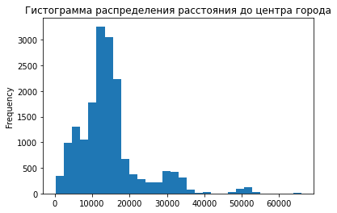
    


Расстояния до центра в 65 км легко объясняются тем, что в таблице есть данные по области, где ближайший город может быть и на таком расстоянии. Тем не менее, уберём из выборки дома, удаленный более чем на 40 км (их чуть больше процента)


```python
data = data.loc[(data['city_centers_nearest'] <= 40000) | (data['city_centers_nearest'].isna())]
data['city_centers_nearest'].plot(kind = 'hist', bins = 20, title = 'Гистограмма распределения расстояния до центра города')
```


    <AxesSubplot:title={'center':'Гистограмма распределения расстояния до центра города'}, ylabel='Frequency'>


    
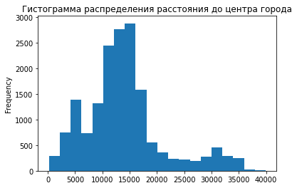
    


```python
data['parks_nearest'].plot(kind = 'hist', bins = 30, title = 'Гистограмма распределения расстояния до ближайшего парка')
print('Максимальное расстояние до центра:',data['parks_nearest'].max())
print('Медианное расстояние до центра:', data['parks_nearest'].median())
print('Доля квартир, удалённых от ближайшего парка более чем на 2 км:',\
      len(data.query('parks_nearest > 2000'))/len(data))
```

    Максимальное расстояние до центра: 3190.0
    Медианное расстояние до центра: 458.0
    Доля квартир, удалённых от ближайшего парка более чем на 2 км: 0.0048141214228403315


    
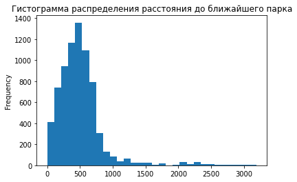
    


В расстояниях до ближайшего парка нет сильно выбивающихся значений.


```python
data = data[(data['parks_nearest'] <= 2000) | (data['parks_nearest'].isna())]
data['parks_nearest'].plot(kind = 'hist', bins = 20, title = 'Гистограмма распределения расстояния до ближайшего парка')
```


    <AxesSubplot:title={'center':'Гистограмма распределения расстояния до ближайшего парка'}, ylabel='Frequency'>


    
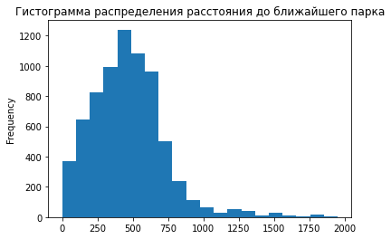
    


```python
print('Количество квартир до убирания выбивающихся значений:', old_data_size)
print('После:', len(data))
print('Доля:', len(data)/old_data_size)
data.info()
```

    Количество квартир до убирания выбивающихся значений: 23699
    После: 22326
    Доля: 0.9420650660365416
    <class 'pandas.core.frame.DataFrame'>
    Int64Index: 22326 entries, 0 to 23698
    Data columns (total 28 columns):
     #   Column                  Non-Null Count  Dtype         
    ---  ------                  --------------  -----         
     0   total_images            22326 non-null  int64         
     1   last_price              22326 non-null  int64         
     2   total_area              22326 non-null  float64       
     3   first_day_exposition    22326 non-null  datetime64[ns]
     4   rooms                   22326 non-null  int64         
     5   ceiling_height          22171 non-null  float64       
     6   floors_total            22245 non-null  float64       
     7   living_area             20535 non-null  float64       
     8   floor                   22326 non-null  int64         
     9   is_apartment            2604 non-null   object        
     10  studio                  22326 non-null  object        
     11  open_plan               22326 non-null  object        
     12  kitchen_area            20164 non-null  float64       
     13  balcony                 22326 non-null  int64         
     14  locality_name           22326 non-null  object        
     15  airports_nearest        16899 non-null  float64       
     16  city_centers_nearest    16918 non-null  float64       
     17  parks_around3000        22326 non-null  int64         
     18  parks_nearest           7232 non-null   float64       
     19  ponds_around3000        22326 non-null  int64         
     20  ponds_nearest           8173 non-null   float64       
     21  days_exposition         19451 non-null  float64       
     22  price_per_square        22326 non-null  float64       
     23  exposition_day_of_week  22326 non-null  int64         
     24  exposition_month        22326 non-null  int64         
     25  exposition_year         22326 non-null  int64         
     26  floor_type              22326 non-null  object        
     27  city_center_km          16918 non-null  float64       
    dtypes: datetime64[ns](1), float64(12), int64(10), object(5)
    memory usage: 4.9+ MB


Как мы видим, количество "подходящих" данных составило около 94% 

*Примечание: в первой версии было отсеяно 35% из-за того, что на каждом этапе убирались не только выбивающиеся значения, но и отсутствующие*

#### Исследование статистики скорости продажи квартир


```python

data['days_exposition'].plot(kind = 'hist', bins = 20,\
                             title = 'Гистограмма времени продажи квартир')
print('Среднее время продажи квартир:', data['days_exposition'].mean())
print('Медианное время продажи квартир:', data['days_exposition'].median())
print('Максимальное время продажи квартиры:', data['days_exposition'].max())
#print('95% значений лежит в диапазоне', data['days_exposition'].quantile(0), data['days_exposition'].quantile(0.75))
print('Доля квартир, проданных за 20 дней и быстрее', len(data.query('days_exposition <= 20'))/len(data))
```

    Среднее время продажи квартир: 175.85224410056037
    Медианное время продажи квартир: 93.0
    Максимальное время продажи квартиры: 1580.0
    Доля квартир, проданных за 20 дней и быстрее 0.10857296425692019


    
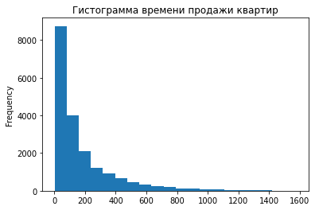
    


```python
#data.boxplot('days_exposition')
iqr = data['days_exposition'].quantile(0.75) - data['days_exposition'].quantile(0.25) # межквартильный размах
mst = [max(data['days_exposition'].quantile(0.25) - 1.5*iqr, 0), data['days_exposition'].quantile(0.75) + 1.5 * iqr]
print('Диапазон нормальных значений:', *mst)
print('Доля значений, не вошедших в нормальные', len(data.query('days_exposition > 508'))/len(data))
```

    Диапазон нормальных значений: 0 491.5
    Доля значений, не вошедших в нормальные 0.06776852100689779


Среднее время продажи квартиры составляет 175.8 дней, в то время как медиана составляет 93 дней. При этом больше 10% квартир продаются быстрее, чем за 21 день. Но есть и те, которые продаются почти 5 лет(1580 дней).

"Доверительный интервал" (1.5 межквартильного размаха от первого и третьего квартилей) составил значения от 0 до 492 дней. Дольше 492 дней продавались около 7% квартир

Аномально медленными продажами будем считать те, что составляют больше 492 дней. Быстрыми - 20 дней и меньше.

#### Изучение факторов, влияющих на стоимость


```python
data.plot(x = 'total_area', y = 'last_price', kind = 'scatter', sharex = False, grid = True,\
          title = 'График зависимости стоимости квартиры от общей площади (диаграмма рассеяния)')
print('Коэффицент корреляции между общей площадью квартиры и стоимостью:', data['total_area'].corr(data['last_price']))
```

    Коэффицент корреляции между общей площадью квартиры и стоимостью: 0.7631228172833686


    
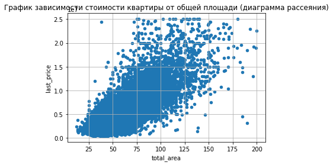
    


* Коэффициент корреляции между стоимостью квартиры и её площадью составил примерно 0.76, что говорит о наличии достаточно сильной зависимости между этими двумя величинами
* Из графика видно, что чем больше цена и площадь квартиры, тем больше есть резко выбивающихся значений (есть квартира площадью 75 м$^2$ и стоимостью в 25 млн., а есть квартира площадью около 180м$^2$ и стоимостью всего в ~3.5 млн.)
*Применчание: масштаб на графике не самый привычный: значения на оси ординат указаны в десятках миллионов рублей*


```python
data.plot(x = 'living_area', y = 'last_price', kind = 'scatter', sharex = False, grid = True,\
          title = 'График зависимости стоимости квартиры от жилой площади (диаграмма рассеяния)')
print('Коэффицент корреляции между жилой площадью квартиры и стоимостью:', data['living_area'].corr(data['last_price']))
```

    Коэффицент корреляции между жилой площадью квартиры и стоимостью: 0.6533822058363213


    
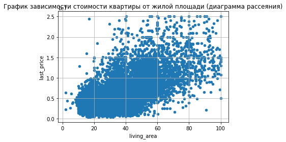
    


 Коэффициент корреляции между стоимостью квартиры и жилой площадью составил примерно 0.65, что меньше, чем корреляция между стоимостью и общей площадью, но зависимость всё ещё прослеживается


```python
data.plot(x = 'kitchen_area', y = 'last_price', kind = 'scatter', sharex = False, grid = True,\
          title = 'График зависимости стоимости квартиры от площади кухни (диаграмма рассеяния)')
print('Коэффицент корреляции между площадью кухни и стоимостью:', data['kitchen_area'].corr(data['last_price']))
```

    Коэффицент корреляции между площадью кухни и стоимостью: 0.554585068906858


    
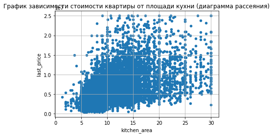
    


Зависимость стоимости квартиры от площади кухни ещё меньше (коэффициент корреляции ~0.55), что видно и на графике (общий тренд сохраняется, но всё больше сильно выбивающихся значений)


```python
data.plot(x = 'rooms', y = 'last_price', kind = 'scatter', sharex = False, grid = True, alpha = 0.1,\
         title = 'График зависимости стоимости квартиры от количества комнат (диаграмма рассеяния)')
#data.plot.bar('rooms', 'last_price')

floor_bar = pd.pivot_table(data, index = 'rooms', values = 'last_price', aggfunc = ['median', 'mean'])
floor_bar.columns = ['median', 'mean']
floor_bar.plot(kind = 'bar', y = ['median', 'mean'], title = 'Диаграмма зависимости стоимости квартиры от количества комнат')
display(floor_bar)
print('Коэффицент корреляции между количеством комнат и стоимостью:', data['rooms'].corr(data['last_price']))
```


<div>

<table border="1" class="dataframe">
  <thead>
    <tr style="text-align: right;">
      <th></th>
      <th>median</th>
      <th>mean</th>
    </tr>
    <tr>
      <th>rooms</th>
      <th></th>
      <th></th>
    </tr>
  </thead>
  <tbody>
    <tr>
      <th>0</th>
      <td>2700000</td>
      <td>2.960060e+06</td>
    </tr>
    <tr>
      <th>1</th>
      <td>3600000</td>
      <td>3.796316e+06</td>
    </tr>
    <tr>
      <th>2</th>
      <td>4750000</td>
      <td>5.328929e+06</td>
    </tr>
    <tr>
      <th>3</th>
      <td>6000000</td>
      <td>7.041819e+06</td>
    </tr>
    <tr>
      <th>4</th>
      <td>8000000</td>
      <td>9.168255e+06</td>
    </tr>
    <tr>
      <th>5</th>
      <td>10500000</td>
      <td>1.083285e+07</td>
    </tr>
  </tbody>
</table>
</div>


    Коэффицент корреляции между количеством комнат и стоимостью: 0.4745837805140472


    
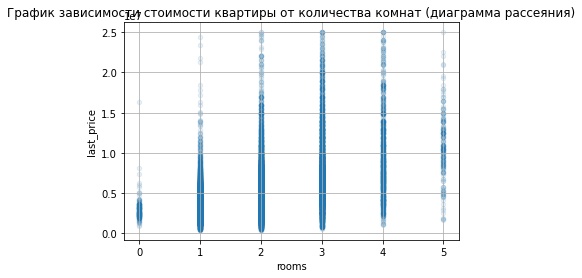
    


    
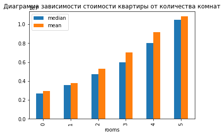
    


Была построена не только диаграмма рассеяния, но и столбчатая диаграмма, т.к. параметр количества комнат принимает лишь 5 значений и диаграмма рассеяния выглядит не очень понятно

Коэффициент корреляции чуть примерно 0.47, по графику можно увидеть некую зависимость (в среднем чем больше комнат, тем дороже квартира), однако она не очень явная


```python
floor_bar = pd.pivot_table(data, index = 'floor_type', values = 'last_price', aggfunc = ['median', 'mean'])
floor_bar.columns = ['median', 'mean']
floor_bar.plot(kind = 'bar', y = ['median', 'mean'], title = 'Диаграмма зависимости стоимости квартиры от типа этажа')
floor_bar
```


<div>

<table border="1" class="dataframe">
  <thead>
    <tr style="text-align: right;">
      <th></th>
      <th>median</th>
      <th>mean</th>
    </tr>
    <tr>
      <th>floor_type</th>
      <th></th>
      <th></th>
    </tr>
  </thead>
  <tbody>
    <tr>
      <th>другой</th>
      <td>4700000</td>
      <td>5.633439e+06</td>
    </tr>
    <tr>
      <th>первый</th>
      <td>3899500</td>
      <td>4.379763e+06</td>
    </tr>
    <tr>
      <th>последний</th>
      <td>4200000</td>
      <td>5.078009e+06</td>
    </tr>
  </tbody>
</table>
</div>


    
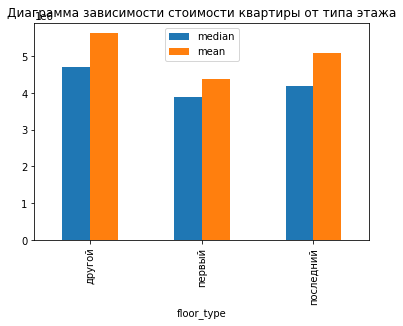
    


Т.к. тип этажа - не колличественная величина, то посчитать корреляцию нельзя. Были вычислены средние и медианные стоимости квартир в зависимости от типа этажа: видно, что в среднем квартиры на первом этаже самые дешевые, а квартиры на последнем этаже дешевле, чем на промежуточных этажах. Однако разница не очень значительная.


```python
floor_bar = pd.DataFrame({'median': [data[data['exposition_day_of_week'] == i]['last_price'].median() for i in range(7)], \
                          'mean': [data[data['exposition_day_of_week'] == i]['last_price'].mean() for i in range(7)]},\
                        index = ['Понедельник', 'Вторник', 'Среда', 'Четверг', 'Пятница', 'Суббота', 'Воскресенье'])
floor_bar.plot(kind = 'bar', y = ['median', 'mean'], title = 'Диаграмма зависимости стоимости квартиры от дня недели подачи объявления')
display(floor_bar)
```


<div>

<table border="1" class="dataframe">
  <thead>
    <tr style="text-align: right;">
      <th></th>
      <th>median</th>
      <th>mean</th>
    </tr>
  </thead>
  <tbody>
    <tr>
      <th>Понедельник</th>
      <td>4550000.0</td>
      <td>5.388305e+06</td>
    </tr>
    <tr>
      <th>Вторник</th>
      <td>4600000.0</td>
      <td>5.420365e+06</td>
    </tr>
    <tr>
      <th>Среда</th>
      <td>4600000.0</td>
      <td>5.460048e+06</td>
    </tr>
    <tr>
      <th>Четверг</th>
      <td>4500000.0</td>
      <td>5.470250e+06</td>
    </tr>
    <tr>
      <th>Пятница</th>
      <td>4500000.0</td>
      <td>5.372276e+06</td>
    </tr>
    <tr>
      <th>Суббота</th>
      <td>4500000.0</td>
      <td>5.259219e+06</td>
    </tr>
    <tr>
      <th>Воскресенье</th>
      <td>4500000.0</td>
      <td>5.292278e+06</td>
    </tr>
  </tbody>
</table>
</div>


    
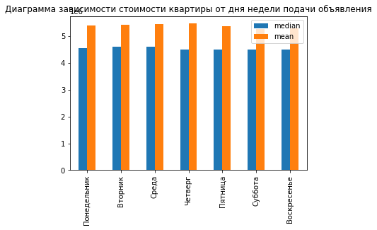
    


Никакой связи между ценой квартиры и днём недели подачи объявления не обнаружено


```python
floor_bar = pd.DataFrame({'median': [data[data['exposition_month'] == i]['last_price'].median() for i in range(12)], \
                          'mean': [data[data['exposition_month'] == i]['last_price'].mean() for i in range(12)]},\
                        index = ['Январь', 'Февраль', 'Март', 'Апрель', 'Май', 'Июнь', 'Июль', 'Август', 'Сентябрь', 'Октябрь', 'Ноябрь', 'Декабрь'])
floor_bar.plot(kind = 'bar', y = ['median', 'mean'], title = 'Диаграмма зависимости стоимости квартиры от месяца подачи объявления')
display(floor_bar)
```


<div>

<table border="1" class="dataframe">
  <thead>
    <tr style="text-align: right;">
      <th></th>
      <th>median</th>
      <th>mean</th>
    </tr>
  </thead>
  <tbody>
    <tr>
      <th>Январь</th>
      <td>NaN</td>
      <td>NaN</td>
    </tr>
    <tr>
      <th>Февраль</th>
      <td>4500000.0</td>
      <td>5.409440e+06</td>
    </tr>
    <tr>
      <th>Март</th>
      <td>4580000.0</td>
      <td>5.380038e+06</td>
    </tr>
    <tr>
      <th>Апрель</th>
      <td>4575000.0</td>
      <td>5.396485e+06</td>
    </tr>
    <tr>
      <th>Май</th>
      <td>4700000.0</td>
      <td>5.486699e+06</td>
    </tr>
    <tr>
      <th>Июнь</th>
      <td>4489500.0</td>
      <td>5.372058e+06</td>
    </tr>
    <tr>
      <th>Июль</th>
      <td>4300000.0</td>
      <td>5.183002e+06</td>
    </tr>
    <tr>
      <th>Август</th>
      <td>4500000.0</td>
      <td>5.329377e+06</td>
    </tr>
    <tr>
      <th>Сентябрь</th>
      <td>4500000.0</td>
      <td>5.357226e+06</td>
    </tr>
    <tr>
      <th>Октябрь</th>
      <td>4600000.0</td>
      <td>5.590984e+06</td>
    </tr>
    <tr>
      <th>Ноябрь</th>
      <td>4500000.0</td>
      <td>5.328502e+06</td>
    </tr>
    <tr>
      <th>Декабрь</th>
      <td>4600000.0</td>
      <td>5.482447e+06</td>
    </tr>
  </tbody>
</table>
</div>


    
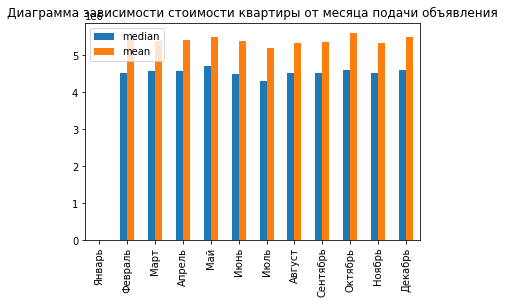
    


Никакой связи между ценой квартиры и месяцем подачи объявления также нет


```python
floor_bar = pd.pivot_table(data, index = 'exposition_year', values = 'last_price', aggfunc = ['median', 'mean'])
floor_bar.columns = ['median', 'mean']
floor_bar.plot(kind = 'bar', y = ['median', 'mean'], title = 'Диаграмма зависимости стоимости квартиры от года подачи объявления')
display(floor_bar)
```


<div>

<table border="1" class="dataframe">
  <thead>
    <tr style="text-align: right;">
      <th></th>
      <th>median</th>
      <th>mean</th>
    </tr>
    <tr>
      <th>exposition_year</th>
      <th></th>
      <th></th>
    </tr>
  </thead>
  <tbody>
    <tr>
      <th>2014</th>
      <td>6125625</td>
      <td>7.992585e+06</td>
    </tr>
    <tr>
      <th>2015</th>
      <td>5100000</td>
      <td>6.067416e+06</td>
    </tr>
    <tr>
      <th>2016</th>
      <td>4422000</td>
      <td>5.406472e+06</td>
    </tr>
    <tr>
      <th>2017</th>
      <td>4400000</td>
      <td>5.294080e+06</td>
    </tr>
    <tr>
      <th>2018</th>
      <td>4500000</td>
      <td>5.268916e+06</td>
    </tr>
    <tr>
      <th>2019</th>
      <td>4990000</td>
      <td>5.726492e+06</td>
    </tr>
  </tbody>
</table>
</div>


    
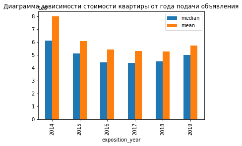
    


Видно, что стоимость квартир в 2014 году была заметно выше, чем в остальные года. Среди же остальных нет сильной разницы не заметно

#### Средняя цена квадратного метра


```python
#data.sort_values(by = )
mean_sq_price_data = pd.pivot_table(data, index = 'locality_name', values = 'rooms', aggfunc = 'count')
mean_sq_price_data.columns = ['count']
mean_sq_price_data = mean_sq_price_data.sort_values(by = 'count', ascending = False)
mean_sq_price_data = mean_sq_price_data.query('count >=232')#232 - количество объявлений в 10м по количеству объявлений населённом пункте (Стрельна)
mean_sq_price_data = mean_sq_price_data.join(pd.pivot_table(data, index = 'locality_name', values = 'price_per_square', aggfunc = 'mean'))
mean_sq_price_data['price_per_square'] = mean_sq_price_data['price_per_square'].astype('int') # потеря копеек смысла не поменяет, а таблица становится понятнее
display(mean_sq_price_data)

```


<div>

<table border="1" class="dataframe">
  <thead>
    <tr style="text-align: right;">
      <th></th>
      <th>count</th>
      <th>price_per_square</th>
    </tr>
    <tr>
      <th>locality_name</th>
      <th></th>
      <th></th>
    </tr>
  </thead>
  <tbody>
    <tr>
      <th>Санкт-Петербург</th>
      <td>14717</td>
      <td>109188</td>
    </tr>
    <tr>
      <th>посёлок Мурино</th>
      <td>589</td>
      <td>86087</td>
    </tr>
    <tr>
      <th>деревня Кудрово</th>
      <td>469</td>
      <td>95383</td>
    </tr>
    <tr>
      <th>посёлок Шушары</th>
      <td>438</td>
      <td>78754</td>
    </tr>
    <tr>
      <th>Всеволожск</th>
      <td>395</td>
      <td>68630</td>
    </tr>
    <tr>
      <th>Пушкин</th>
      <td>354</td>
      <td>102149</td>
    </tr>
    <tr>
      <th>Колпино</th>
      <td>335</td>
      <td>75233</td>
    </tr>
    <tr>
      <th>посёлок Парголово</th>
      <td>326</td>
      <td>90332</td>
    </tr>
    <tr>
      <th>Гатчина</th>
      <td>305</td>
      <td>68727</td>
    </tr>
    <tr>
      <th>Выборг</th>
      <td>232</td>
      <td>57886</td>
    </tr>
  </tbody>
</table>
</div>


Среди 10 самых "популярных" населённых пунктов самое дорогое жильё в Санкт-Петербурге (средняя цена за квадратный метр - 109188 рублей), а самое дешёвое - в Выборге (средняя цена за квадратный метр - 57886 рубля)

#### Зависимость цены от расстояния от центра


```python
spb_center_prices = pd.pivot_table(data.query('locality_name == "Санкт-Петербург"'),\
                                   index = 'city_center_km', values = 'last_price', aggfunc = 'mean')
spb_center_prices.columns = ['mean_price']
spb_center_prices.plot(kind = 'bar', y = 'mean_price', title = 'Диаграмма зависимости стоимости квартиры от расстояния от центра города')
spb_center_prices
```


<div>

<table border="1" class="dataframe">
  <thead>
    <tr style="text-align: right;">
      <th></th>
      <th>mean_price</th>
    </tr>
    <tr>
      <th>city_center_km</th>
      <th></th>
    </tr>
  </thead>
  <tbody>
    <tr>
      <th>0.0</th>
      <td>9.261818e+06</td>
    </tr>
    <tr>
      <th>1.0</th>
      <td>1.038676e+07</td>
    </tr>
    <tr>
      <th>2.0</th>
      <td>9.941784e+06</td>
    </tr>
    <tr>
      <th>3.0</th>
      <td>8.891317e+06</td>
    </tr>
    <tr>
      <th>4.0</th>
      <td>9.344029e+06</td>
    </tr>
    <tr>
      <th>5.0</th>
      <td>9.649269e+06</td>
    </tr>
    <tr>
      <th>6.0</th>
      <td>8.668761e+06</td>
    </tr>
    <tr>
      <th>7.0</th>
      <td>8.175877e+06</td>
    </tr>
    <tr>
      <th>8.0</th>
      <td>8.123884e+06</td>
    </tr>
    <tr>
      <th>9.0</th>
      <td>6.220758e+06</td>
    </tr>
    <tr>
      <th>10.0</th>
      <td>6.132902e+06</td>
    </tr>
    <tr>
      <th>11.0</th>
      <td>5.763330e+06</td>
    </tr>
    <tr>
      <th>12.0</th>
      <td>5.726437e+06</td>
    </tr>
    <tr>
      <th>13.0</th>
      <td>5.948991e+06</td>
    </tr>
    <tr>
      <th>14.0</th>
      <td>5.501560e+06</td>
    </tr>
    <tr>
      <th>15.0</th>
      <td>5.625787e+06</td>
    </tr>
    <tr>
      <th>16.0</th>
      <td>5.289886e+06</td>
    </tr>
    <tr>
      <th>17.0</th>
      <td>5.126979e+06</td>
    </tr>
    <tr>
      <th>18.0</th>
      <td>4.768795e+06</td>
    </tr>
    <tr>
      <th>19.0</th>
      <td>5.037675e+06</td>
    </tr>
    <tr>
      <th>20.0</th>
      <td>4.611579e+06</td>
    </tr>
    <tr>
      <th>21.0</th>
      <td>5.423991e+06</td>
    </tr>
    <tr>
      <th>22.0</th>
      <td>5.343680e+06</td>
    </tr>
    <tr>
      <th>23.0</th>
      <td>4.689843e+06</td>
    </tr>
    <tr>
      <th>24.0</th>
      <td>3.854430e+06</td>
    </tr>
    <tr>
      <th>25.0</th>
      <td>4.052840e+06</td>
    </tr>
    <tr>
      <th>26.0</th>
      <td>3.973013e+06</td>
    </tr>
    <tr>
      <th>27.0</th>
      <td>8.300000e+06</td>
    </tr>
    <tr>
      <th>28.0</th>
      <td>5.026429e+06</td>
    </tr>
    <tr>
      <th>29.0</th>
      <td>4.236667e+06</td>
    </tr>
  </tbody>
</table>
</div>


    
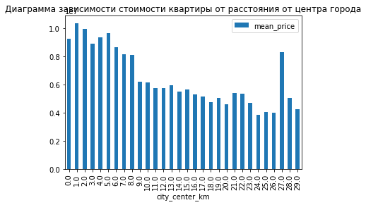
    


В целом виден тренд, что чем дальше от центра города, тем дешевле квартиры. Характерно выделяется только всплеск на 27 км от центра (Возможно, он связан с тем, что в 27 км от центра находится город Пушкин, и некоторые указали локацию "Санкт-Петербург", но возможны и другие причины или просто недостаток выборки)

### Напишите общий вывод

**Предобработка:** 
* на этапе предобработки были обнаружены пропуски данных в 14 столбцах и заполнены типичными значениями там, где это было возможно. Пропуски остались в столбцах *floors_total*, *is_apartment*, *airport_nearest*, *city_centers_nearest*, *parks_around3000*, *ponds_around3000* и *days_exposition*. 
* Также на этом этапе были изменены типы данных некоторых столбцов для дальнейшей обработки
* Также выборка была очищена от неявных дубликатов

**Добавление столбцов:** в таблицу для удобства дальнейшего анализа были добавлены след. столбцы:
* *price_per_square* - цена за квадратный метр квартиры
* *exposition_day_of_week*, *exposition_month* и *exposition_year* - день недели, месяц и год публикации объявления
* *floor_type* - тип этажа квартиры (первый, последний или другой)
* *city_center_km* - расстояние до центра города в километрах

**Исследовательский анализ**

1) Были построены гистограмы распределения различных параметров квартиры, из выборки были удалены сильно выбивающиеся значения. Большинство графиков по виду стали схожи с распределением Пуассона. После удаления выбивающихся значений выборка уменьшилась примерно на 6%

2) Было найдено среднее время продажи квартир (175 дней) и медианное (93 дня) и при этом обнаружено, что некоторые квартиры продавались более, чем 1500 дней.  Аномально медленными продажами будем считать те, что составляют больше 492 дней. Быстрыми - 20 дней и меньше.

3) Была проведена проверка зависимости стоимости квартиры от разных факторов:
* Коэффициент корреляции стоимости квартиры от общей площади составил ~0.76
* Коэффициент корреляции стоимости квартиры от жилой площади составил ~0.67
* Коэффициент корреляции стоимости квартиры от площади кухни составил ~0.55
* Коэффициент корреляции стоимости квартиры от количества комнат составил 0.47
* Квартиры на первом этаже в среднем несколько дешевле, чем квартиры на последнем этаже. А квартиры на последнем этаже в среднем несколько дешевле квартир на промежуточных этажах
* Цена квартиры не зависит от дня недели и месяца публикации объявления
* В 2014 году был резкий скачок цен на недвижимость (или же было их резкое падение в 2015)

Таким образом можно сказать, что цена на квартиру больше всего зависит от её общей площади

4) Было составлена таблица средних цен за квадратный метр по 10 населённым пунктам с наибольшим количеством объявлений: самое дорогое жильё оказалось в Санкт-Петербурге, самое дешёвое - в Выборге

5) Была составлена зависимость цены на квартиру в Санкт-Петербурге в зависимости от расстояния от центра. В среднем, чем дальше от центра, тем дешевле квартиры
